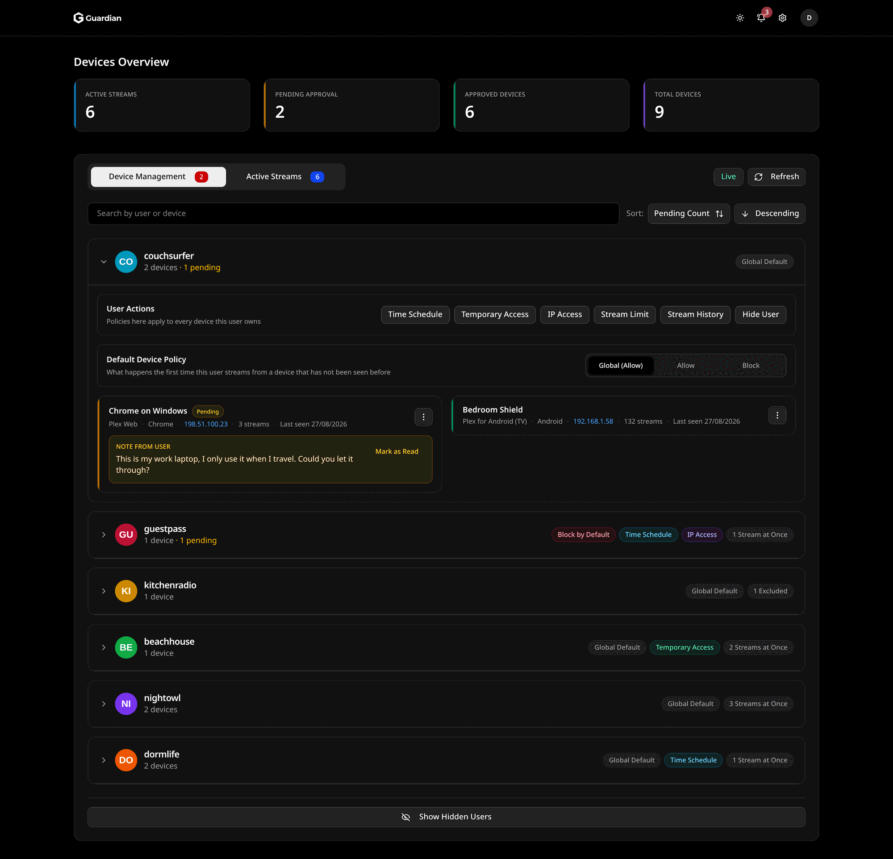
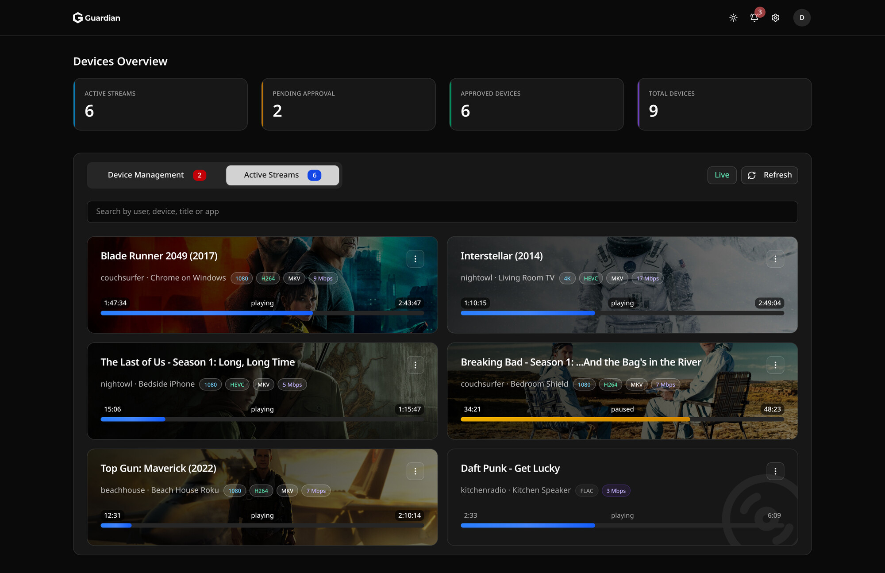
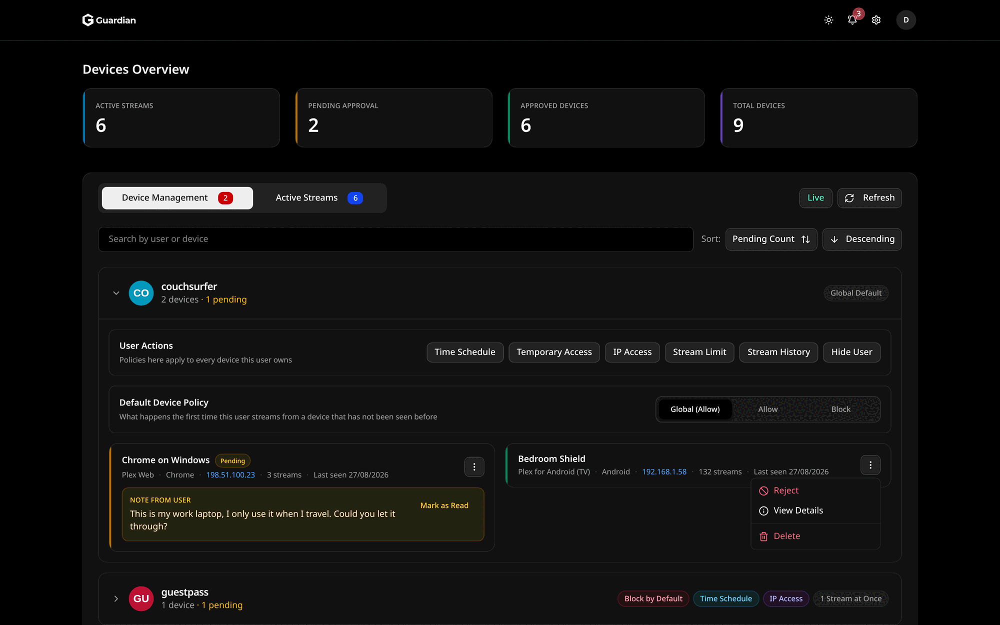
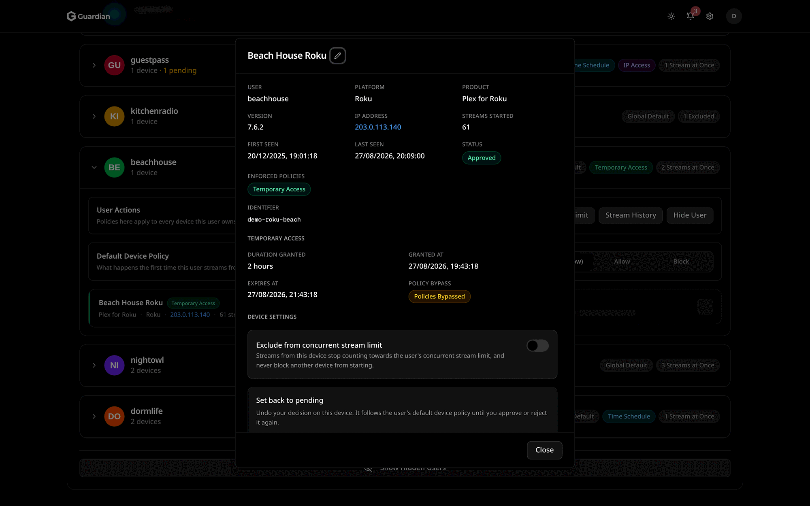
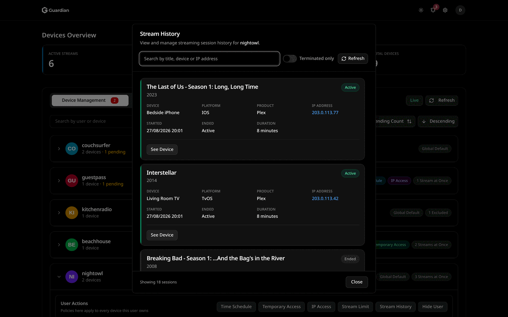
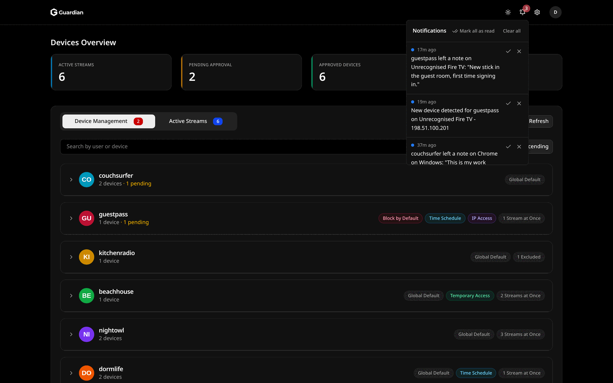
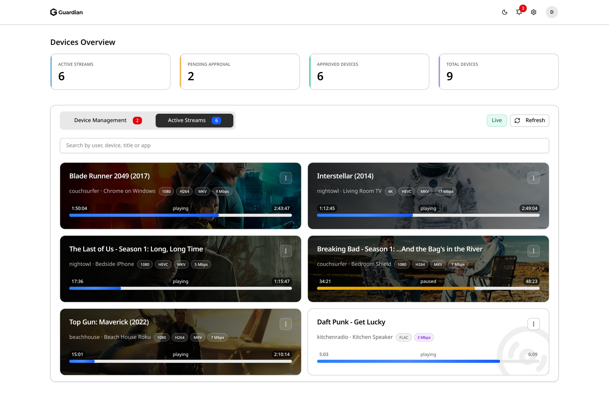

# Guardian

[](https://github.com/HydroshieldMKII/Guardian/actions/workflows/ci.yml)
[](https://github.com/HydroshieldMKII/Guardian/actions/workflows/cd.yml)
[](https://codecov.io/gh/HydroshieldMKII/Guardian?flags[0]=frontend)
[](https://codecov.io/gh/HydroshieldMKII/Guardian?flags[0]=backend)
[](https://hub.docker.com/r/hydroshieldmkii/guardian)
[](https://github.com/HydroshieldMKII/Guardian/stargazers)
[](https://discord.gg/xTKuHyhdS4)


Guardian is an access-control layer for Plex Media Server. It polls the Plex sessions API, matches each stream against per-user and per-device policy, and terminates the sessions that fail.

> [!WARNING]
> **Looking for a maintainer.** Reach out on [Discord](https://discord.gg/xTKuHyhdS4) or in [Discussions](https://github.com/HydroshieldMKII/Guardian/discussions).
>
> Do not expose Guardian directly to the internet. Run it on a LAN, behind a VPN, or behind a reverse proxy with SSO.





<details>
<summary>More screenshots</summary>











</details>

## Features

| Area | Capabilities |
| --- | --- |
| Access control | Approve, reject or hold devices; global default plus per-user overrides; LAN/WAN and CIDR allowlists over IPv4 and IPv6; weekly time schedules; time-limited temporary grants |
| Limits | Global and per-user concurrent stream caps, with an option to exclude devices on a temporary grant |
| Monitoring | Live Plex and Plexamp sessions, device fingerprints, stream quality and progress, searchable session history |
| Notifications | SMTP email, Apprise (100+ services) and in-app alerts for new devices, blocks, location changes and user notes |
| Administration | Settings export/import, automatic cleanup of inactive devices, CLI recovery scripts |
| User portal | Plex users sign in to see their own devices, the policies that apply to them, and to leave notes on rejected devices |

## Requirements

- A reachable Plex Media Server and a [Plex authentication token](https://support.plex.tv/articles/204059436-finding-an-authentication-token-x-plex-token/)
- Docker with Compose, or Node.js to run from source

## Installation

### Docker

```bash
mkdir -p guardian && cd guardian
curl -o docker-compose.yml https://raw.githubusercontent.com/HydroshieldMKII/Guardian/main/docker-compose.example.yml
docker compose up -d
```

The web UI listens on port 3000 by default

### From source

```bash
git clone https://github.com/HydroshieldMKII/Guardian.git
cd Guardian
docker compose -f docker-compose.dev.yml up -d --build
```

### Unraid

Under **Docker → Compose**, create a stack from `docker-compose.example.yml`, adjust the volume and port, and deploy.

## Configuration

| Variable | Default | Purpose |
| --- | --- | --- |
| `TRUST_PROXY_HOPS` | `1` | Number of proxies in front of Guardian. Determines which address in `X-Forwarded-For` is treated as the client. |
| `APP_URL` | unset | Public address Guardian is reached on, for example `https://guardian.example.com`. Used to build password reset links. Required for password resets; ignored otherwise. |
| `DATABASE_PATH` | `/app/data/plex-guard.db` | SQLite database file. |


## Updating

> [!IMPORTANT]
> Export your settings first: **Settings → Admin Tools → Export Settings**.

```bash
docker compose pull && docker compose up -d
```

## Troubleshooting

**Lost admin access**

```bash
docker compose exec guardian node backend/src/scripts/list-admins.js
docker compose exec guardian node backend/src/scripts/update-admin.js "USERNAME" "NEW_PASSWORD"
```

**Locked out by captcha**

```bash
docker compose exec guardian node backend/src/scripts/disable-captcha.js
```

**Cannot connect to Plex** — check that the server is reachable from the container, the token is valid, and that SSL settings match the server.

**Notifications not arriving** — use the test buttons in Settings, then check credentials and spam filtering.

**Reset emails not arriving** — confirm SMTP works with the test button, confirm `APP_URL` is set, and confirm the admin account has an email address.

Otherwise, ask on [Discord](https://discord.gg/xTKuHyhdS4) or open an [issue](https://github.com/HydroshieldMKII/Guardian/issues).

## Development

```bash
cd backend  && npm ci && npm run start:dev   # port 3001
cd frontend && npm ci && npm run dev         # port 3000
```

Run before opening a pull request:

```bash
(cd backend  && npm run lint:ci && npm run typecheck && npm run test:cov && npm run build)
(cd frontend && npm run typecheck && npm run test:cov && npm run build)
```

## Contributing

Open an issue with the bug or feature template, or a pull request with the checklist filled in. Report security issues through a [private advisory](https://github.com/HydroshieldMKII/Guardian/security/advisories/new), not a public issue.

## License

Released under the [PolyForm Noncommercial License 1.0.0](LICENSE.md). Fork it, change it and share it for any noncommercial purpose, keeping the copyright notice with it. Commercial use is not covered. The software comes with no warranty.
